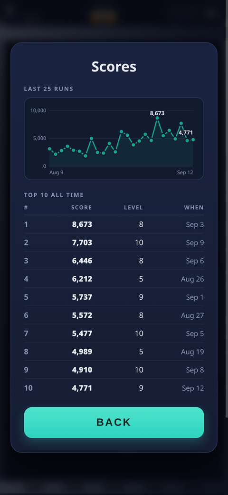

# Clogged

A falling-block puzzle game about unblocking a drain. Hairballs are matted into
the pipework; drop two-tone pipe couplings on top of them and line up **four of
a colour** — across or down — to flush them away. Clear every last clog to open
the level.

**▶ [Play it](https://epiphenomena.github.io/clogged/)** — works offline, installs to your home screen.

<p align="center">
  
  
  
  
</p>

## Playing

Couplings fall in pairs of two coloured halves. Land them so four same-coloured
cells line up and the whole run dissolves. Hairballs count toward a run, so the
goal is always to build lines *through* them.

Three details make or break a plan:

- **Hairballs never fall.** They stay wherever the level wedged them, even with
  nothing underneath, so you can build up to one.
- **Half a coupling falls on its own.** When one half of a pair is flushed the
  survivor is cut loose and drops — which is how you set up chains. Loose halves
  lose their bolted flange and shrink to a plain plug, so you can see at a glance
  which pieces are free.
- **Clogs keep coming.** A level's quota is not all sitting there at the start.
  The harder the level, the smaller the share wedged in when it opens — the rest
  wash down the pipe as you play — one every few couplings, aimed at the deepest column so it settles low.
  Sometimes one catches on something it brushes past on the way down and wedges
  there instead, leaving an overhang to build under; it will only ever snag low
  enough in the pipe that a line can still be run through it. The counter in the
  header is what is *left*, arrived or not, so a level is not over until the
  queue is empty too.
- **The pipe grows.** Levels 0–4 are played in an 8×16 pipe, levels 5–9 in a
  10×20 one, and level 10 onward in a 12×24 one. It always fills the screen: the
  fittings get smaller rather than the pipe getting longer, and couplings fall
  proportionally faster so one still crosses the screen in about the same time.
  The level picker on the title screen names the pipe you are about to play in,
  and shows it behind the menu.
- **Pressure builds, eventually.** Nothing changes for the first minute — longer
  on a big level, which honestly takes longer to clear. After that the couplings
  speed up a few percent every 30 seconds, topping out around 1.7× after five
  and a half minutes of stalling. It punishes dithering, not ordinary play.

Chains multiply your score: each cascade step in a single landing doubles the
multiplier, up to 16×.

Each level's colours are dealt out evenly, so no single colour can run away with
a board and strand the other two.

## Scores

Every finished run is kept on the device — when you top out, quit mid-run, or
restart a level. Clearing a level does not end a run, so a long climb is filed
once, under its final score.

**Scores** — on the title screen, in the pause menu, and after a game ends —
shows two things: the last 25 runs plotted over time, and the all-time top ten
with the level reached and the date. Touch the chart to read any run off it.

Two lists are stored rather than one. The rolling window behind the chart keeps
the 50 most recent runs, while the top ten is never evicted by age — so a great
score from a hundred games ago still holds its place.

## Controls

The pipe itself is the controller — there is no button row to cover the board.

| Action | Touch | Keyboard |
| --- | --- | --- |
| Aim | Drag anywhere on the pipe | <kbd>←</kbd> <kbd>→</kbd> |
| Spin | Tap | <kbd>Z</kbd> or <kbd>↑</kbd> |
| Spin the other way | Swipe up | <kbd>X</kbd> |
| Ease down | Drag downward | <kbd>↓</kbd> |
| Slam | Flick down | <kbd>Space</kbd> |
| Pause | The pause button in the header | <kbd>P</kbd> or <kbd>Esc</kbd> |

Dragging maps your finger to an absolute column, so the piece tracks your thumb
instead of drifting, and dragging downward walks the piece down with you. A
dashed outline previews where it will land.

One gesture, two directions: the game decides which one you mean from where your
finger is travelling *now*, not from where the drag began. While you are heading
down, the sideways part is ignored — a thumb arcs on its way down a phone screen,
and that arc used to nudge the coupling out of the column you had just aimed at.
Aim, ease down, and aim again all work inside a single drag. A slam likewise has
to be going mostly downward, so a quick swipe across with a droop in it does not
fire one.

### Spinning in a tight spot

A quarter turn leaves the anchor half where it is and swings its partner around.
When the partner's cell is taken, the pair may shift by one cell — a kick — and
the offsets are tried in a fixed order, so the same situation always resolves the
same way:

1. in place;
2. one cell away from whatever is in the way — sideways when the coupling is
   lying down against a wall or a stack, upward when it is standing up off the
   floor;
3. one cell sideways, for a standing turn pinched between neighbours.

A kick never moves the pair **downward**: gaining a row on a turn would let a
coupling slip past a slot you could still have slid into. The one exception is
the mouth of the pipe, where there is no row above to borrow, so a coupling on
the top row drops a row in order to stand up.

Anything still blocked after that is refused and the coupling keeps its current
orientation. In a one-wide well — no room either side at its own row or the row
above — it simply stays lying down.

Each colour also carries a shape — ring, bar, cross — so the game is playable
without relying on colour vision.

## Picking up where you left off

A game in progress is written to the device whenever a coupling starts falling
and whenever you put the game down — pausing, switching tabs, switching apps.
If the phone kills the tab in the background, the title screen offers **Resume
game** with the level and score it is holding, and picks up paused so you are
not dropped straight back under a falling coupling.

Starting a new game or losing clears it, so a finished run never lingers as a
ghost. Anything read back from storage is validated field by field first: a
half-written record, a save from an older build, or something hand-edited is
discarded rather than booting the game into a broken state.

One limit worth knowing: the snapshot is skipped while a cascade is resolving,
because the board is briefly mid-clear and inconsistent. Put the game down at
that exact moment and it resumes from the start of the current coupling
instead — a second or two of progress, never the run.

## Pausing

The pause button sits in the top-right corner, and the menu behind it offers
**Resume**, **New game**, **High scores** and the **sound** toggle. Starting a
new game banks the run you were on before handing back the title screen, so
walking away from a game never loses its score.

The game also pauses itself whenever it stops being the thing you are looking
at: switching tabs, switching apps, or another window taking focus while this
one stays visible. Losing focus only ever pauses — it will not resume a game
sitting behind a menu you are still reading.

## Install

Open the link on a phone and choose **Add to Home Screen**. It runs standalone
and fully offline after the first load. Scores are kept in `localStorage` on the
device; there is no account, server, or telemetry.

**A note on caching while the game is in flux:** [`sw.js`](sw.js) deliberately
precaches nothing and goes to the network first, keeping only a fallback copy for
offline use. Edits therefore show up on the next load without anyone clearing a
cache by hand. Once the game settles down, switch it back to precaching a
versioned asset list for a faster cold start.

## Development

No build step, no dependencies, no framework. Clone it and serve the folder:

```sh
python3 -m http.server 8000
# then open http://localhost:8000
```

Use a real HTTP server rather than opening `index.html` directly — browsers
refuse to register a service worker over `file://`.

The rules live in [`core.js`](core.js) as pure functions over a board array,
with no DOM access, so they can be tested directly:

```sh
node test/core.test.js    # board rules
node test/scores.test.js  # score history
node test/save.test.js    # suspended-game snapshots
node test/smoke.test.js   # boots the real game.js against a stubbed DOM and plays it
```

The first covers match detection, coupling splitting, gravity, cascades, rotation
kicks, level seeding, arrivals, and the pressure ramp; the second covers
recording, the two caps, ranking, and surviving junk in storage; the third covers
snapshot round-trips and every way a stored record can be malformed. The last
stubs enough DOM and
canvas for [`game.js`](game.js) to run headlessly, then drives it with a greedy
player that clears levels — so wiring and state-machine regressions get caught
without a browser. All four are plain node scripts with no dependencies; run
them before you push.

| File | What's in it |
| --- | --- |
| `core.js` | Board rules — matching, gravity, cascades, seeding, arrivals, speed |
| `scores.js` | Score history — the rolling window and the all-time table |
| `save.js` | Suspended-game snapshots, and the validation that guards them |
| `game.js` | Canvas rendering, gestures, game loop, scoring, effects |
| `style.css` | Layout and theming, mobile-first |
| `sw.js` | Offline fallback (see the caching note above) |

## Deploying

The repo root is the site — there is nothing to build. Under
**Settings → Pages → Source**, choose **Deploy from a branch** and pick `main`
with the `/ (root)` folder. Every push to `main` then republishes it.

The `.nojekyll` file keeps Pages from running the site through Jekyll. Every
path in the app is relative and the manifest's `start_url` is `./`, so it works
from a project subpath like `/clogged/` as happily as from a domain root, or
from any other static host.

## License

[MIT](LICENSE)
