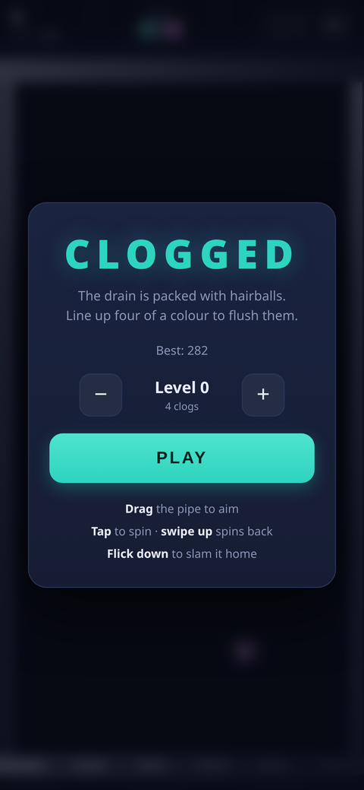
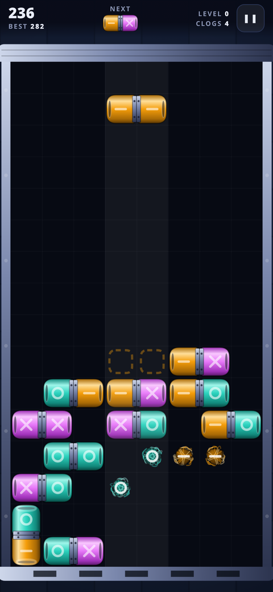
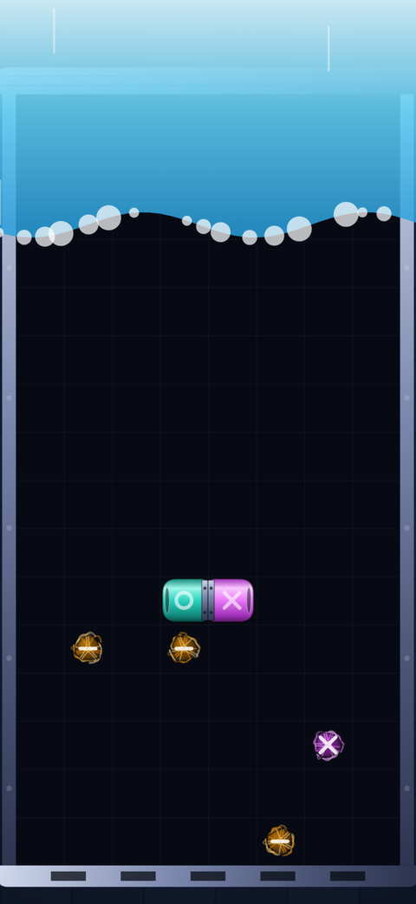

# Clogged

A falling-block puzzle game about unblocking a drain. Hairballs are matted into
the pipework; drop two-tone pipe couplings on top of them and line up **four of
a colour** — across or down — to flush them away. Clear every last clog to open
the level.

**▶ [Play it](https://epiphenomena.github.io/clogged/)** — works offline, installs to your home screen.

<p align="center">
  
  
  
</p>

## Playing

Couplings fall in pairs of two coloured halves. Land them so four same-coloured
cells line up and the whole run dissolves. Hairballs count toward a run, so the
goal is always to build lines *through* them.

Three details make or break a plan:

- **Hairballs never fall.** They stay wherever the level wedged them, even with
  nothing underneath, so you can build up to one.
- **Half a coupling falls on its own.** When one half of a pair is flushed the
  survivor is cut loose and drops — which is how you set up chains. Loose halves
  lose their bolted flange and shrink to a plain plug, so you can see at a glance
  which pieces are free.
- **Pressure builds.** The longer a level goes unsolved, the faster couplings
  fall. Stalling is not free.

Chains multiply your score: each cascade step in a single landing doubles the
multiplier, up to 16×.

## Controls

The pipe itself is the controller — there is no button row to cover the board.

| Action | Touch | Keyboard |
| --- | --- | --- |
| Aim | Drag anywhere on the pipe | <kbd>←</kbd> <kbd>→</kbd> |
| Spin | Tap | <kbd>Z</kbd> or <kbd>↑</kbd> |
| Spin the other way | Swipe up | <kbd>X</kbd> |
| Ease down | Drag downward | <kbd>↓</kbd> |
| Slam | Flick down | <kbd>Space</kbd> |
| Pause | ❚❚ in the header | <kbd>P</kbd> or <kbd>Esc</kbd> |

Dragging maps your finger to an absolute column, so the piece tracks your thumb
instead of drifting, and dragging downward walks the piece down with you. A
dashed outline previews where it will land.

Each colour also carries a shape — ring, bar, cross — so the game is playable
without relying on colour vision.

## Install

Open the link on a phone and choose **Add to Home Screen**. It runs standalone
and fully offline after the first load. Scores are kept in `localStorage` on the
device; there is no account, server, or telemetry.

**A note on caching while the game is in flux:** [`sw.js`](sw.js) deliberately
precaches nothing and goes to the network first, keeping only a fallback copy for
offline use. Edits therefore show up on the next load without anyone clearing a
cache by hand. Once the game settles down, switch it back to precaching a
versioned asset list for a faster cold start.

## Development

No build step, no dependencies, no framework. Clone it and serve the folder:

```sh
python3 -m http.server 8000
# then open http://localhost:8000
```

Use a real HTTP server rather than opening `index.html` directly — browsers
refuse to register a service worker over `file://`.

The rules live in [`core.js`](core.js) as pure functions over a board array,
with no DOM access, so they can be tested directly:

```sh
node test/core.test.js   # board rules
node test/smoke.test.js  # boots the real game.js against a stubbed DOM and plays it
```

The first covers match detection, coupling splitting, gravity, cascades, rotation
kicks, level seeding, and the pressure ramp. The second stubs enough DOM and
canvas for [`game.js`](game.js) to run headlessly, then drives it with a greedy
player that clears levels — so wiring and state-machine regressions get caught
without a browser. Both are plain node scripts with no dependencies; run them
before you push.

| File | What's in it |
| --- | --- |
| `core.js` | Board rules — matching, gravity, cascades, seeding, speed |
| `game.js` | Canvas rendering, gestures, game loop, scoring, effects |
| `style.css` | Layout and theming, mobile-first |
| `sw.js` | Offline fallback (see the caching note above) |

## Deploying

The repo root is the site — there is nothing to build. Under
**Settings → Pages → Source**, choose **Deploy from a branch** and pick `main`
with the `/ (root)` folder. Every push to `main` then republishes it.

The `.nojekyll` file keeps Pages from running the site through Jekyll. Every
path in the app is relative and the manifest's `start_url` is `./`, so it works
from a project subpath like `/clogged/` as happily as from a domain root, or
from any other static host.

## License

[MIT](LICENSE)
